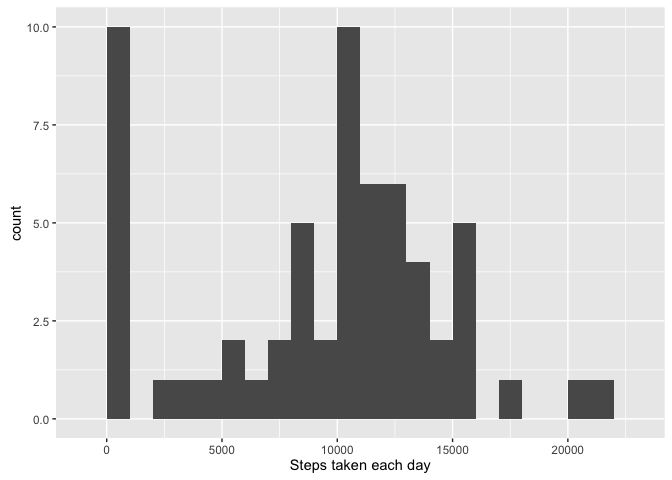
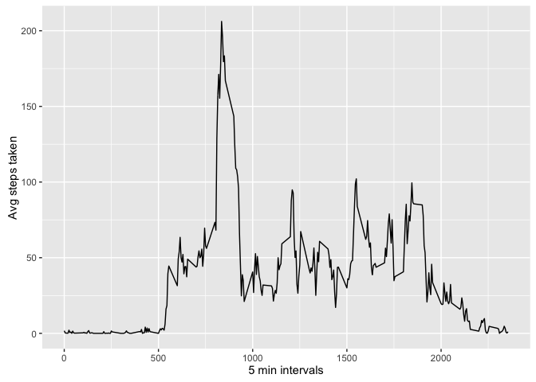
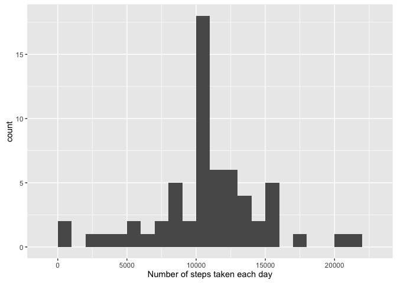
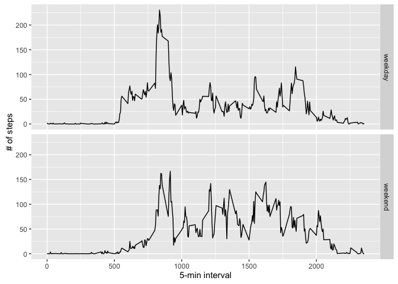

# Reproducible Research: Peer Assessment 1


```r
library(knitr)
opts_chunk$set(echo = TRUE)
```


## Loading and preprocessing the data

```r
library(ggplot2)
unzip(zipfile="activity.zip")
data <- read.csv("activity.csv")
```


## What is mean total number of steps taken per day?

```r
allSteps <- tapply(data$steps, data$date, FUN=sum, na.rm=TRUE)
qplot(allSteps, binwidth=1000, xlab="Steps taken each day")
```



```r
mean(allSteps, na.rm=TRUE)
```

```
## [1] 9354.23
```

```r
median(allSteps, na.rm=TRUE)
```

```
## [1] 10395
```


## What is the average daily activity pattern?

```r
avgs <- aggregate(x=list(steps=data$steps), by=list(interval=data$interval),FUN=mean, na.rm=TRUE)
ggplot(data=avgs, aes(x=interval, y=steps)) +
    geom_line() +
    xlab("5 min intervals") +
    ylab("Avg steps taken")
```


##On average across all the days in the dataset, the 5-minute interval contains the maximum number of steps?

```r
avgs[which.max(avgs$steps),]
```

```
##     interval    steps
## 104      835 206.1698
```

## Imputing missing values

```r
table(is.na(data$steps))
```

```
## 
## FALSE  TRUE 
## 15264  2304
```

## Are there differences in activity patterns between weekdays and weekends?
All of the missing values are filled in with mean value for that 5-minute
interval.


```r
# Replace each missing value with the mean value of its 5-minute interval
fill.value <- function(steps, interval) {
    filled <- NA
    if (!is.na(steps))
        filled <- c(steps)
    else
        filled <- (avgs[avgs$interval==interval, "steps"])
    return(filled)
}
filled.data <- data
filled.data$steps <- mapply(fill.value, filled.data$steps, filled.data$interval)
```

Histogram of the number of steps taken each day from the filled data then calculate the mean and median number of steps.


```r
total.steps <- tapply(filled.data$steps, filled.data$date, FUN=sum)
qplot(total.steps, binwidth=1000, xlab="Number of steps taken each day")
```



```r
mean(total.steps)
```

```
## [1] 10766.19
```

```r
median(total.steps)
```

```
## [1] 10766.19
```
Mean and median values are higher after imputing missing data.

## Are there differences in activity patterns between weekdays and weekends?
Day of the week for each measurement in the dataset. Use the dataset with the filled-in values.


```r
weekday.or.weekend <- function(date) {
    day <- weekdays(date)
    if (day %in% c("Monday", "Tuesday", "Wednesday", "Thursday", "Friday"))
        return("weekday")
    else if (day %in% c("Saturday", "Sunday"))
        return("weekend")
    else
        stop("invalid date")
}
filled.data$date <- as.Date(filled.data$date)
filled.data$day <- sapply(filled.data$date, FUN=weekday.or.weekend)
```
Plots of average number of steps taken on weekdays and weekends.

```r
avgs <- aggregate(steps ~ interval + day, data=filled.data, mean)
ggplot(avgs, aes(interval, steps)) + geom_line() + facet_grid(day ~ .) +
    xlab("5-min interval") + ylab("# of steps")
```


